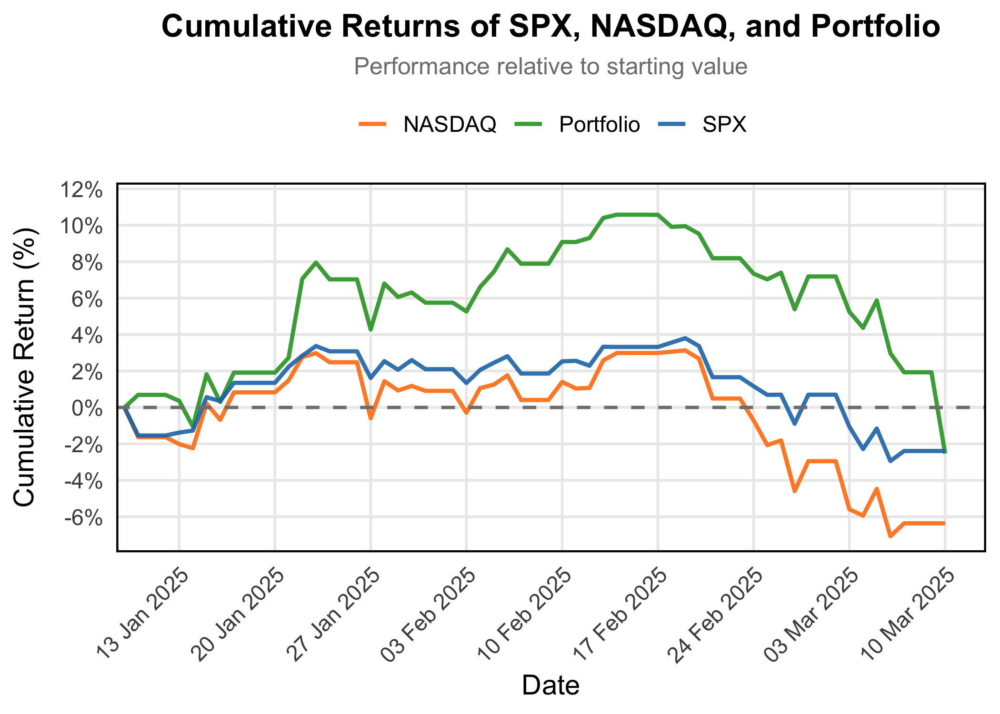

# Lajos Galambos

## ABOUT
Hello! I'm Lajos Galambos, an investment manager specializing in wealth management, portfolio analysis, and sustainable investment projects. I have extensive experience in financial markets and currently oversee diverse asset classes, including equities, real estate, and eco-tourism ventures.

- **LinkedIn:** [Lajos Galambos](https://www.linkedin.com/in/lajosgalambos)
- **GitHub:** [galamboslajos](https://github.com/galamboslajos)
- **Email:** [info@galamboscapital.com](mailto:info@galamboscapital.com)

[Download My CV](./Lajos_Galambos_CV.pdf)

---

## Investment Management
I actively manage investment portfolios focusing on long-term wealth growth and risk-adjusted returns. Below is a recent performance chart of my portfolio:

My investment strategy emphasizes diversified asset allocation, leveraging quantitative analysis and market insights to optimize returns.

---

## Forest Escapes - Eco Tourism Project
One of my latest projects is **Forest Escapes**, an eco-tourism initiative aimed at sustainable and luxurious getaways in nature.

This project focuses on **sustainable architecture**, **off-grid living**, and **immersive nature experiences** to create a unique eco-friendly retreat.

For inquiries or collaborations, feel free to reach out!

---

## Blog
### Latest Posts
_(New posts will be added on top)_

**Post Title 1** *(March 5, 2025)*  
Lorem ipsum dolor sit amet, consectetur adipiscing elit. Nulla quis lorem ut libero malesuada feugiat.

**Post Title 2** *(March 3, 2025)*  
Sed porttitor lectus nibh. Nulla quis lorem ut libero malesuada feugiat.

---

## Website Navigation
[About](#about) | [Investment Management](#investment-management) | [Forest Escapes](#forest-escapes---eco-tourism-project) | [Blog](#blog)
