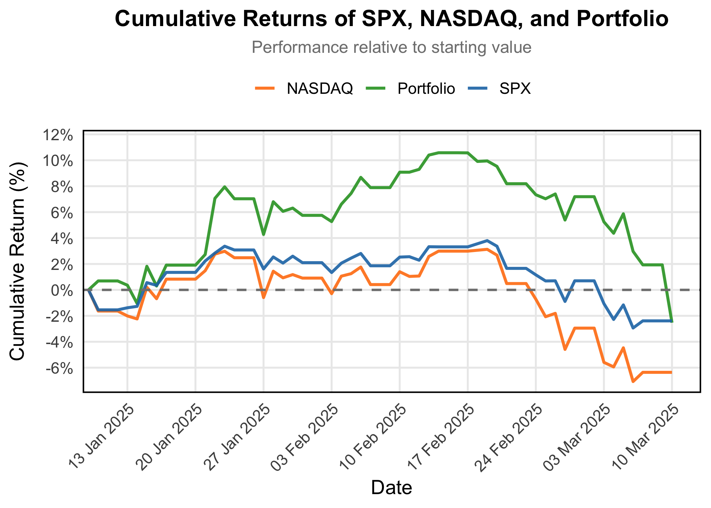

<nav>
  <ul style="list-style-type: none; display: flex; justify-content: center; padding: 10px; background-color: #f4f4f4;">
    <li style="margin: 0 15px;"><a href="#about" onclick="showSection('about')">About</a></li>
    <li style="margin: 0 15px;"><a href="#investment-management" onclick="showSection('investment-management')">Investment Management</a></li>
    <li style="margin: 0 15px;"><a href="#forest-escapes" onclick="showSection('forest-escapes')">Forest Escapes</a></li>
    <li style="margin: 0 15px;"><a href="#blog" onclick="showSection('blog')">Blog</a></li>
  </ul>
</nav>

  <h2>ABOUT</h2>
  
    
I’m an investment and wealth management analyst, currently managing a €3M multi-asset portfolio for a private HNW client, covering equities, fixed income, real estate, and alternative investments. I previously interned at Granit Asset Management, contributing to equity and real estate front-office projects.

  
  
I hold a Master’s in Economics, Data, and Policy from Central European University and a degree in International Relations from Corvinus University. Over the years, I’ve built financial analysis and data-driven decision-making skills, which I’m now putting to work in real-world investment projects. Whether it's optimizing portfolios, exploring eco-tourism investments, or structuring sustainable strategies, I’m all about turning insights into action.

  
  
I have a deep appreciation for economic science and its role in shaping societies, policies, and markets. Beyond my work in investment analysis, I actively learn various fields within economics, from development economics to macroeconomics. I also maintain a strong interest in international relations and global affairs, regularly following geopolitical dynamics and policy shifts. A specific focus of mine has been Western Balkan and Central Eastern European affairs, both in terms of economic development and political evolution, as these regions present unique challenges and opportunities within the broader European landscape.

  

  
<strong>LinkedIn:</strong> <a href="https://www.linkedin.com/in/lajosgalambos">Lajos Galambos</a>

  
<strong>GitHub:</strong> <a href="https://github.com/galamboslajos">galamboslajos</a>

  
<strong>Email:</strong> <a href="mailto:info@galamboscapital.com">info@galamboscapital.com</a>

  
<a href="./Lajos_Galambos_CV.pdf" style="font-weight:bold;">Download My CV</a>

  <h2>Investment Management</h2>
 
My investment strategy is rooted in Modern Portfolio Theory, prioritizing mean-variance portfolio optimization, long-term growth, and risk-adjusted returns. The focus is on constructing a well-balanced, high-quality equity portfolio with strong statistical expectations while maintaining sectoral diversification.

  
  
While the portfolio is tech-heavy, U.S. focused, and primarily large-cap, diversification occurs across industries rather than geographies, ensuring exposure to different economic cycles. This approach might allow for capturing high-growth opportunities in technology while balancing the portfolio with consumer staples, finance, and healthcare holdings to mitigate sector-specific risks.

  
  

  <h2>Forest Escapes - Eco Tourism Project</h2>
  
One of my latest projects is <strong>Forest Escapes</strong>, an eco-tourism initiative aimed at sustainable and luxurious getaways in nature.

  

  <h2>Blog</h2>
  
Latest Posts _(New posts will be added on top)_

  <strong>Post Title 1</strong> *(March 5, 2025)*  
  
Lorem ipsum dolor sit amet, consectetur adipiscing elit. Nulla quis lorem ut libero malesuada feugiat.

  <strong>Post Title 2</strong> *(March 3, 2025)*  
  
Sed porttitor lectus nibh. Nulla quis lorem ut libero malesuada feugiat.

