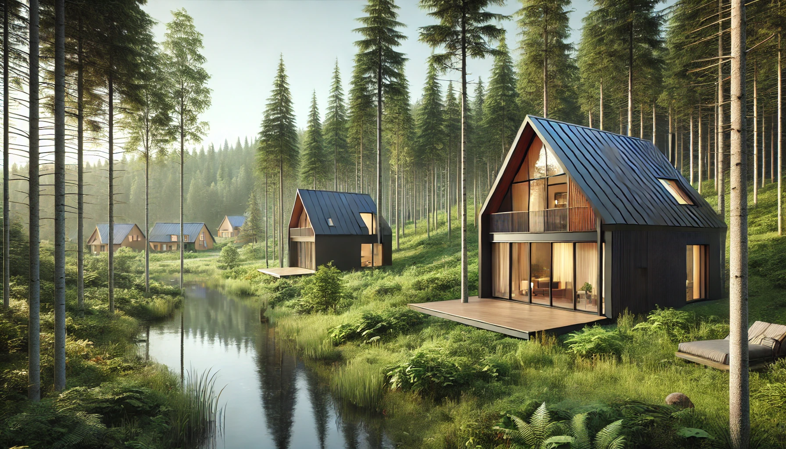

<nav>
  <ul style="list-style-type: none; display: flex; justify-content: center; padding: 10px; background-color: #f4f4f4;">
    <li style="margin: 0 15px;"><a href="#about" onclick="showSection('about')">About</a></li>
    <li style="margin: 0 15px;"><a href="#investment-management" onclick="showSection('investment-management')">Investment Management</a></li>
    <li style="margin: 0 15px;"><a href="#forest-escapes" onclick="showSection('forest-escapes')">Forest Escapes</a></li>
    <li style="margin: 0 15px;"><a href="#blog" onclick="showSection('blog')">Blog</a></li>
  </ul>
</nav>

  <h2>ABOUT</h2>
  
  
Hello! I'm Lajos Galambos, an investment manager specializing in wealth management, portfolio analysis, and sustainable investment projects. I have extensive experience in financial markets and currently oversee diverse asset classes, including equities, real estate, and eco-tourism ventures.

  - **LinkedIn:** [Lajos Galambos](https://www.linkedin.com/in/lajosgalambos)
  - **GitHub:** [galamboslajos](https://github.com/galamboslajos)
  - **Email:** [info@galamboscapital.com](mailto:info@galamboscapital.com)

  [Download My CV](./Lajos_Galambos_CV.pdf)

  <h2>Investment Management</h2>
  
I actively manage investment portfolios focusing on long-term wealth growth and risk-adjusted returns. Below is a recent performance chart of my portfolio:

  

  <h2>Forest Escapes - Eco Tourism Project</h2>
  
One of my latest projects is <strong>Forest Escapes</strong>, an eco-tourism initiative aimed at sustainable and luxurious getaways in nature.

  

  <h2>Blog</h2>
  
Latest Posts _(New posts will be added on top)_

  <strong>Post Title 1</strong> *(March 5, 2025)*  
  
Lorem ipsum dolor sit amet, consectetur adipiscing elit. Nulla quis lorem ut libero malesuada feugiat.

  <strong>Post Title 2</strong> *(March 3, 2025)*  
  
Sed porttitor lectus nibh. Nulla quis lorem ut libero malesuada feugiat.

